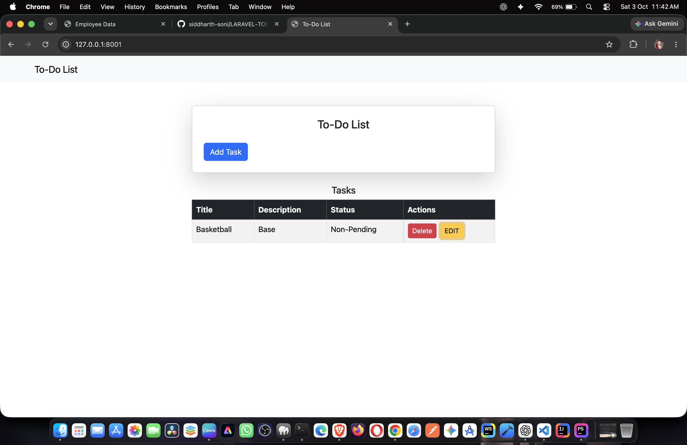
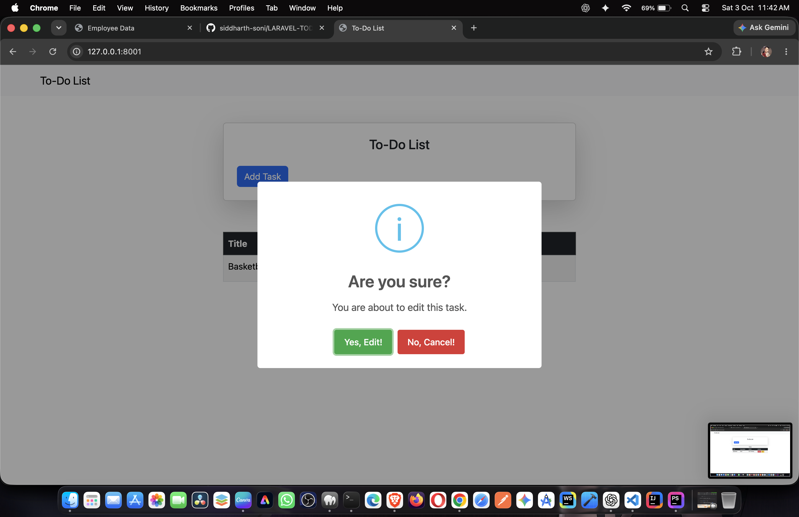
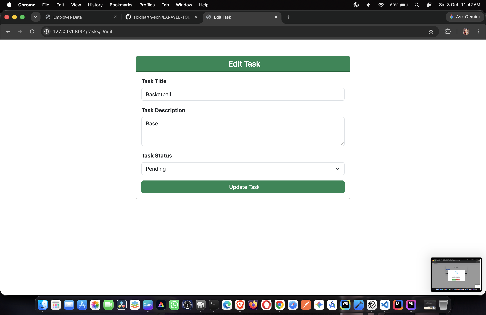
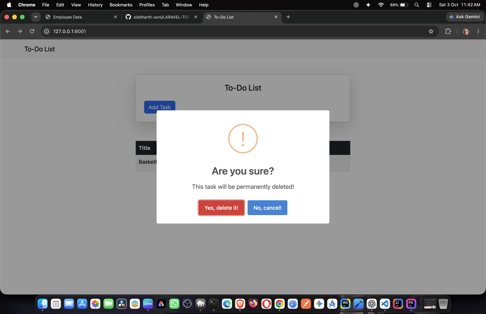

📝 Laravel To-Do List

A simple and responsive To-Do List web application built with Laravel that allows users to manage their daily tasks efficiently.

The application provides a clean interface for viewing, editing, updating, and deleting tasks. Each task can contain a title, description, and status, making it easy to keep track of pending and completed work.

⸻

🚀 Project Overview

The Laravel To-Do List is a CRUD-based task management application developed to demonstrate the core features of Laravel, including:

* MVC architecture
* Routing
* Controllers
* Eloquent ORM
* Database migrations
* Blade templates
* Form handling
* Validation and request handling
* CRUD operations
* Tailwind CSS
* Vite asset bundling

The project provides a straightforward interface where tasks can be managed from a central task list.

⸻

✨ Features

📋 Task Management

* View all available tasks
* Create and manage task information
* Add a task title
* Add a detailed task description
* Track task status
* Edit existing tasks
* Update task information
* Delete tasks
* Mark tasks according to their current status

✏️ Edit Tasks

Each task can be opened through the edit functionality, allowing its:

* Title
* Description
* Status

to be updated.

🗑️ Delete Tasks

Tasks can be permanently removed from the application when they are no longer required.

📊 Task Status

The application maintains a status for each task, allowing tasks to be differentiated according to their current state.

⸻

🖥️ Application Screenshots

### To-Do List Dashboard

### Edit Confirmation

### Edit Task

### Delete Confirmation

⸻

🛠️ Technology Stack

Technology	Purpose
Laravel 11	Backend framework
PHP 8.2+	Server-side programming
Blade	Frontend templating
Tailwind CSS	UI styling
Vite	Frontend asset bundling
Eloquent ORM	Database interaction
MySQL / SQLite	Database
Git & GitHub	Version control

⸻

🏗️ Project Structure

LARAVEL-TODOLIST/
│
├── app/
│   ├── Http/
│   │   └── Controllers/
│   │       └── ToDoListController.php
│   │
│   └── Models/
│       └── ToDoList.php
│
├── bootstrap/
│
├── config/
│
├── database/
│   ├── factories/
│   ├── migrations/
│   └── seeders/
│
├── public/
│
├── resources/
│   ├── css/
│   ├── js/
│   └── views/
│
├── routes/
│   └── web.php
│
├── storage/
│
├── tests/
│
├── screenshots/
│
├── artisan
├── composer.json
├── package.json
├── tailwind.config.js
└── vite.config.js

⸻

🔄 CRUD Operations

The application follows the standard CRUD architecture.

Create

A new task can be added with:

* Title
* Description
* Status

Read

The main page retrieves and displays the available tasks.

Update

Existing tasks can be edited and their information can be updated.

Delete

Tasks that are no longer required can be deleted from the application.

⸻

🧩 Laravel Architecture

The application follows the Laravel MVC architecture.

Model

The ToDoList model is responsible for interacting with the task data stored in the database.

Controller

ToDoListController handles the application’s task-management logic, including:

* Displaying tasks
* Creating task records
* Opening tasks for editing
* Updating tasks
* Deleting tasks

Routes

The application uses Laravel routes to connect HTTP requests with the appropriate controller methods.

Example routes include:

Route::get('/', [ToDoListController::class, 'index']);
Route::get('/tasks/{id}/edit', [ToDoListController::class, 'edit']);
Route::patch('/tasks/{id}', [ToDoListController::class, 'update']);
Route::delete('/tasks/{task}', [ToDoListController::class, 'destroy']);

⸻

⚙️ Installation

1. Clone the Repository

git clone https://github.com/siddharth-soni/LARAVEL-TODOLIST.git

2. Navigate to the Project

cd LARAVEL-TODOLIST

3. Install PHP Dependencies

composer install

4. Install Frontend Dependencies

npm install

5. Create Environment File

cp .env.example .env

6. Generate Application Key

php artisan key:generate

7. Configure Database

Open the .env file and configure your database connection.

For MySQL:

DB_CONNECTION=mysql
DB_HOST=127.0.0.1
DB_PORT=3306
DB_DATABASE=your_database_name
DB_USERNAME=your_database_username
DB_PASSWORD=your_database_password

8. Run Database Migrations

php artisan migrate

9. Start Vite

npm run dev

10. Start Laravel Server

Open another terminal and run:

php artisan serve

The application will normally be available at:

http://127.0.0.1:8000

⸻

💻 Development

For frontend development:

npm run dev

For production asset compilation:

npm run build

To start the Laravel development server:

php artisan serve

⸻

📌 Main Functionality

The application currently provides the following task-management flow:

User
 │
 ▼
To-Do List
 │
 ├── View Tasks
 │
 ├── Edit Task
 │     ├── Update Title
 │     ├── Update Description
 │     └── Update Status
 │
 └── Delete Task

⸻

🎯 Purpose of the Project

This project was developed as a practical Laravel application to demonstrate how a task-management system can be built using Laravel’s MVC architecture and CRUD functionality.

It also provides hands-on experience with:

* Laravel routing
* Controllers
* Eloquent models
* Database migrations
* Blade templates
* HTTP methods
* Form processing
* Tailwind CSS
* Vite
* Git and GitHub

⸻

👨‍💻 Author

Siddharth Soni

GitHub:
https://github.com/siddharth-soni

Repository:
https://github.com/siddharth-soni/LARAVEL-TODOLIST

⸻

📄 License

This project is open-sourced under the MIT License.